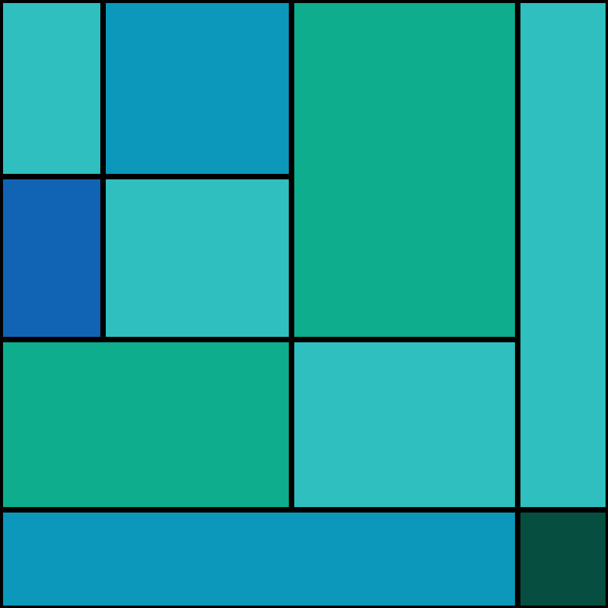
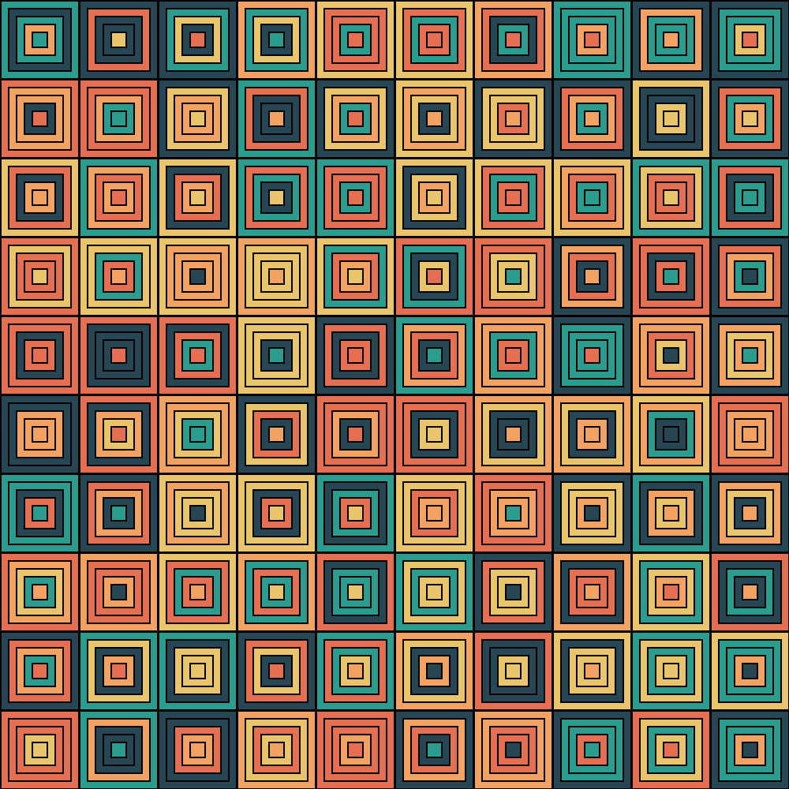
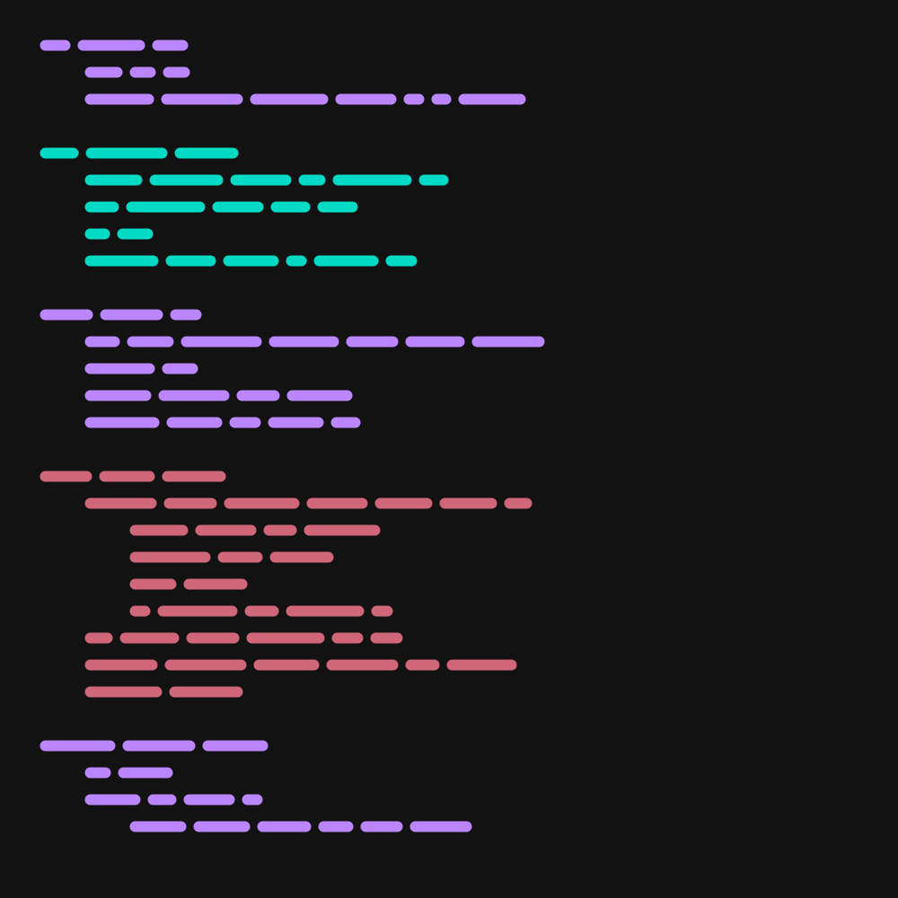

# Generative Art
I'm using Python or Processing4 to create generative works of art in 2D and 3D. Here are some examples of my work. 

### Abstract Rectangles
Random quadrant splitting with triangular distributions

Square stacking algorithm

### Circles

### Minimalist Code

